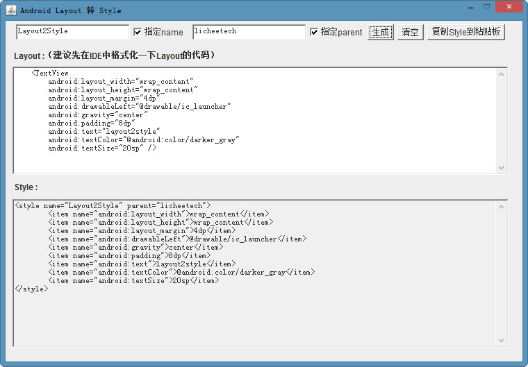

# layout2style
把Android布局转换成style的格式

之前写的鸡肋玩意，把Android布局(layout)转换成style的格式。
`ADT`上面就有`Extract Sytle`的功能，不过不是全部东西都会帮抽取出去，我这个就是不管啥，满足格式就转。

用法：
```
 javaw -jar Layout2Style.jar
```

windows中也可以双击`doubleclick.vbs`运行,当然，无论是敲命令或者双击运行，都得配置好jdk


